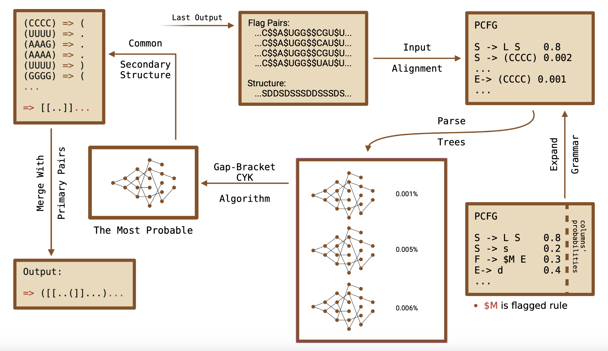

# RNA Pairing Pattern Recognition Using SCFGs and Evolutionary Models

**Author**: Ali Ahmadi Esfidi  
**Date**: January 24, 2025  

---

## 🧬 Overview

This repository provides a comprehensive framework for RNA secondary structure prediction by integrating **Stochastic Context-Free Grammars (SCFGs)** with **evolutionary history**. It builds upon the well-known **KH-99 model** and introduces a novel **Gap-Bracket CYK parsing algorithm** to enhance prediction accuracy, especially for complex motifs like **pseudoknots**.

---

## 🎯 Objectives

- Improve RNA pairing pattern recognition using evolutionary alignments.
- Extend SCFG models to predict both non-crossing and crossing base pairs.
- Introduce a multi-pass parsing strategy using **Gap-Bracket CYK**.
- Estimate production rule probabilities using the **Inside-Outside algorithm**.
- Incorporate phylogenetic information via **maximum-likelihood trees**.

---

## 📚 Background

### 1. RNA Secondary Structure
RNA molecules form structures such as loops, stems, and pseudoknots based on complementary base pairing. Predicting these structures is essential for understanding RNA function.

### 2. KH-99 Model
The **Knudsen-Hein (KH-99)** algorithm applies SCFGs to RNA structure prediction using evolutionary information to improve accuracy.

### 3. SCFGs and PCFGs
Stochastic Context-Free Grammars provide a probabilistic model to describe RNA folding, where grammar rules are weighted by their likelihood of occurrence.

---

## 🧠 Key Features

| Feature                         | KH-99 Framework | Gap-Bracket Framework |
|-------------------------------|------------------|------------------------|
| Inside-Outside Training        | ✅               | ✅                     |
| CYK Parser                     | ✅               | ✅ (Enhanced)          |
| Crossing Pair Detection        | ❌               | ✅ (Multi-Pass)        |
| Bracket Imbalance Scoring      | ❌               | ✅                     |
| Genetic Algorithm Tuning       | ❌               | ✅                     |

---

## 📈 System Architecture

### KH-99 Based Parsing


### Gap-Bracket Enhanced Parsing



---

## 🛠️ Methodology

### Grammar Rules (Example)
```txt
S → L S (91%) | $M E (2%) | s (7%)
F → $M E (67%) | L S (33%)
L → $M E (7%) | s (93%)
$M → B F (100%)
B → d (100%)
E → d (100%)
````

### Multi-Pass Parsing

* **First Pass**: Predict primary (non-crossing) pairs using Gap-Bracket CYK.
* **Second Pass**: Flag known stems, re-parse to find crossing pairs.
* **Third Pass (optional)**: Further refinement (e.g., nested pseudoknots).

### Gap-Bracket CYK

Modifies CYK by:

* Tracking unmatched bracket tokens (`<`, `>`)
* Penalizing mismatched regions
* Adjusting rule probabilities based on start, accelerate, and flag ratios

### Inside-Outside Training

Used to estimate PCFG rule probabilities from aligned sequence-structure pairs.

---

## 🌳 Evolutionary Modeling

* Based on **Rfam** RNA families and **phyml**-based ML phylogenetic trees
* Gap-aware substitution model treats gaps as unknown nucleotides
* Base pair probabilities are estimated via post-order traversal

---

## 🧪 Results

### Accuracy Comparison

| Family      | Gap-Bracket F1 (%) |
| ----------- | ------------------ |
| RF00556     | 86.85              |
| RF00499     | 92.24              |
| RF01084     | 67.46              |
| RF03004     | 100.00             |
| RF01089     | 77.76              |
| RF01093     | 86.73              |
| RF01072     | 81.91              |
| RF01737     | 78.40              |
| **Average** | **82.35**          |

---


## 🧬 Parameter Optimization

Optimal values from genetic algorithm:

| Pass        | Start Ratio | Accelerate Ratio | Flag Ratio |
| ----------- | ----------- | ---------------- | ---------- |
| First Pass  | 0.19        | 1.48             | -          |
| Second Pass | 0.88        | 1.78             | 0.98       |


---

## 🧠 Future Work

* Add **Earley parser** as an alternative to CYK for faster parsing.
* Use **deep learning** to enhance column probability estimation.
* Implement **parallel CYK** to reduce runtime on large alignments.
* Integrate **ensemble models** for final structure voting.

---

## 📜 References

* \[1] Knudsen & Hein (1999, 2003)
* \[2] PFold, PPFold
* \[3] Sükösd & Knudsen, PPFold 3.0
* \[4] Chen et al., E2Efold (NeurIPS 2022)
* \[5] Kato & Seki, SMCFGs
* \[6] Yi et al., Efficient GPU Parsing (2011)
* \[7] Andrikos et al., Knotify (2023)

---

## 📬 Contact

**Ali Ahmadi Esfidi**
Email: [mr-ahmadi2004@outlook.com](mailto:mr-ahmadi2004@outlook.com)
GitHub: [Mr-Ahmadi](https://github.com/Mr-Ahmadi)
LinkedIn: [Ali Ahmadi](https://linkedin.com/in/ali-ahmadi-esfidi-6a0848375)

---