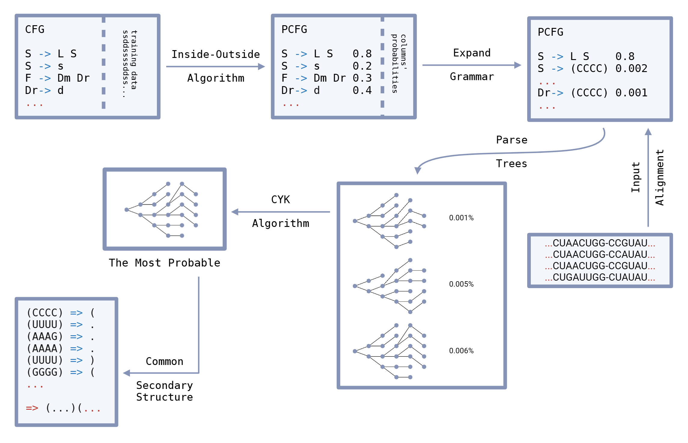
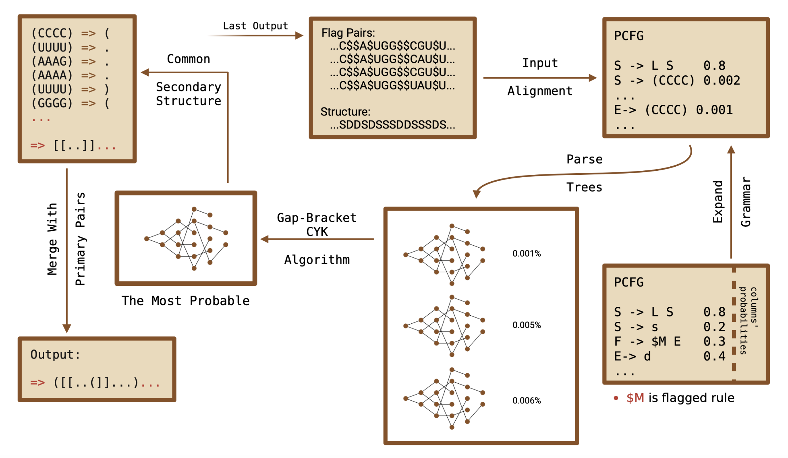

# RNA Pairing Pattern Recognition with SCFGs and Evolutionary History

**Author:** Ali Ahmadi Esfidi

`ekh` predicts the consensus secondary structure of an RNA alignment, pseudoknots
included. It combines the Knudsen–Hein (KH-99) stochastic context-free grammar
with a phylogenetic substitution model, and parses the alignment twice with a
**Gap-Bracket CYK** parser: the first pass finds the nested structure, the
second pass looks for crossing pairs (pseudoknots) among the columns left
unpaired.

The only dependency is NumPy. Predicting one alignment takes about 10–100 ms,
compared with 3 s to over 40 min in the original notebooks (see [Results](#results)).

| KH-99 pipeline | Gap-Bracket pipeline |
| --- | --- |
|  |  |

## Method in brief

1. **Tree.** A neighbour-joining topology, with branch lengths set by maximum
   likelihood under the model's own substitution rates. A PhyML binary can be
   used instead (`--phyml`).
2. **Column evidence.** Felsenstein pruning gives `P(column i)` under a 4-state
   model and `P(columns i, j pair)` under a 16-state dinucleotide model. Gaps
   count as unknown nucleotides. Every column pair is computed at once as an
   `n × n × 16` array.
3. **Grammar.** Rule probabilities of the KH-99 grammar

   ```
   S -> L S | $M E | s      L -> $M E | s      F -> $M E | L S
   $M -> B F                B -> d             E -> d
   ```

   The grammar is unambiguous, so these are the relative rule frequencies in
   the training consensus structures.
4. **Gap-Bracket CYK.** A Viterbi parse of the grammar extended with the column
   evidence. Three ratios change the score of each base pair:
   * `start` for a pair that closes a loop,
   * `accelerate` for a pair stacked on another pair,
   * `flag`, applied once for every first-pass pair that a second-pass pair
     crosses.

   Pass 1 predicts `()`. Pass 2 runs on the columns left unpaired and predicts
   `[]`.

The recursions are documented in [`src/ekh/parser.py`](src/ekh/parser.py) and
in the [report](report/main.tex).

## Install and use

```bash
python -m venv .venv && .venv/bin/pip install -e '.[test]'

.venv/bin/ekh predict alignment.fasta          # FASTA, Stockholm or PHYLIP
.venv/bin/ekh predict alignment.sto --tree tree.nwk
```

```python
from ekh import EKH

model = EKH.load()
prediction = model.predict({"seq1": "GGGGAAAACCCC", "seq2": "GCGGAAAACCGC", "seq3": "GGCGAAAACGCC"})
print(prediction.structure)   # ((((....))))
```

## Reproduce everything

```bash
.venv/bin/ekh estimate      # evolution model + grammar from data/training   (~0.5 s)
.venv/bin/ekh tune          # pass ratios on data/benchmark/validation.json   (~10 s)
.venv/bin/ekh evaluate data/benchmark/validation.json data/benchmark/test.json \
    --output results/evaluation.json
python scripts/summarise.py # bootstrap CIs + report figure (needs matplotlib)
.venv/bin/pytest            # includes an exhaustive-search check of the parser
```

## Results

The test set has 8 Rfam families that were used neither for training nor for
tuning. Scores are pooled base-pair precision, recall and F1. *Weighted* is the
score the original notebooks reported: pair F1 and unpaired-column F1 averaged
with weights 2·(reference pairs) and (reference unpaired columns).

| Model (test set) | Precision | Recall | **F1** | Weighted |
| --- | ---: | ---: | ---: | ---: |
| KH-99 CYK (one pass, all ratios 1) | 0.748 | 0.604 | 0.669 | 0.703 |
| Gap-Bracket, first pass only | 0.770 | 0.731 | 0.750 | 0.750 |
| **Gap-Bracket, two passes** (default) | 0.769 | 0.843 | **0.804** | 0.798 |
| Gap-Bracket, two passes, 2025 genetic-algorithm ratios | 0.793 | 0.858 | 0.824 | 0.818 |

* **Where the gain comes from.** On test, the second pass adds +0.054 F1 over
  the first pass alone (95% family-bootstrap CI 0.006–0.116). The full model
  adds +0.135 over plain KH-99 CYK (CI 0.007–0.331).
* **Why the default ratios score lower.** The default ratios came from a grid
  search on the 8 validation families (validation F1 0.854, vs 0.839 for the
  genetic-algorithm ratios). On test they score 0.020 lower than the
  genetic-algorithm ratios (CI −0.050 to −0.001), which is mild overfitting to
  a very small tuning set. Both sets of ratios were chosen on validation data
  only, so the default was not switched after seeing test scores.
* **Family overlap.** RF01737 appears in both the validation and the test set
  (with different sequences). Without it, test F1 is 0.650 / 0.743 / 0.803 /
  0.826 for the four rows above.
* **Speed.** Predicting all 8 test families takes 0.4 s in total, against
  3.3 s to over 40 min per family for the original notebook code.

Full per-family outputs are in [`results/`](results).

## Repository layout

```
src/ekh/            package: alignment, tree, evolution, grammar, parser, model, metrics, estimate, cli
src/ekh/data/       parameters.json (evolution model, grammar, tuned ratios)
data/training/      Rfam seed alignments, consensus structures and trees (RF00001, RF00005, RF03000 used)
data/benchmark/     validation.json and test.json (alignment + reference structure per family)
results/            evaluation outputs and bootstrap summary
report/             LaTeX report
tests/              unit tests
scripts/            result summary and figure
archive/            original 2025 notebooks (KH-99 and EKH-25), kept for reference
literature/         papers the method builds on
presentation/       slides
```

## What changed from the original notebooks

* The notebooks are now a tested package. Nothing hard-codes absolute paths,
  and no grammar files are written to disk for each prediction.
* **Speed.** The generic dictionary-based CYK over a grammar with one rule per
  column pattern became vectorised recursions over column indices. Column
  likelihoods are array operations instead of a symbolic enumeration of column
  patterns. Result: 50× to over 10,000× faster; the largest alignments gain the most.
* **Correctness fixes:**
  * The stacking ratio used to depend on which derivation of `F` happened to
    score best. Pass 1 and pass 2 now split `F` into its stacked and loop
    derivations, so the ratio is applied exactly. The parser is checked
    against exhaustive enumeration.
  * The crossing penalty used to count only up to the column before the
    closing base. It now counts over the whole span of the pair.
  * Grammar probabilities are exact rule frequencies from the training
    structures. Before, they came from inside–outside on `d/s` strings, which
    loses which bases pair with which.
  * Ambiguous IUPAC symbols are now handled the same way in frequencies and
    rates.
  * The evaluation used to skip unmatched brackets silently. It now rejects
    them. One validation reference (RF01722) had an unmatched `(`, which is now
    written as `.`, matching how it was scored before.
* **Reproduction check.** The re-estimated substitution rates match the
  original pickled parameters to 1e-4 relative. With PhyML trees and the
  original ratios, the new code comes close to the 2025 report (weighted 0.817 vs
  0.824; four of the eight families agree within 0.1 points; see
  [`results/evaluation_phyml_trees.json`](results/evaluation_phyml_trees.json)).

## References

* Knudsen & Hein (1999, 2003). *RNA secondary structure prediction using stochastic context-free grammars and evolutionary history*; *Pfold*.
* Sükösd et al. (2012). *PPfold 3.0*.
* Felsenstein (1981). *Evolutionary trees from DNA sequences: a maximum likelihood approach*.
* Kato et al. (2006). *Stochastic multiple context-free grammar for RNA pseudoknot modeling*.
* Andrikos et al. (2023). *Knotify*.
* Yi et al. (2011). *Efficient parallel CKY parsing on GPUs*.

## Contact

Ali Ahmadi Esfidi · [aliahmadiesfidi@outlook.com](mailto:aliahmadiesfidi@outlook.com) · [GitHub](https://github.com/Mr-Ahmadi) · [LinkedIn](https://linkedin.com/in/ali-ahmadi-esfidi-6a0848375)
